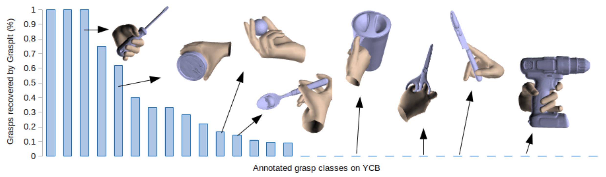

# YCB-Affordance Dataset



We release a large-scale dataset of manually annotated grasps on the 58 objects of the YCB Benchmark Set. This contain grasps such as those in the following image, which are not found by Graspit Simulator or any other automatic pipeline. For each grasp, we annotate the hand position, the hand pose and the grasp type according to the grasp taxonomy of Feix et al. We transfer these grasps to the 92 Video sequences from the YCB-Video dataset, and remove those grasps that are not feasible, due to interpenetrations with other objects or with the table. The dataset contains 133.936 frames, with more than 28M of realistic grasps.

## Prerequisites

Prerequisites are only needed for visualization. You can download the dataset ...

- Python requirements. Run `pip install -r requirements.txt`.

- **MANO layer**: Follow instructions from the MANO layer project in [here](https://raw.githubusercontent.com/hassony2/manopth).

- Copy MANO_LEFT.pkl and MANO_RIGHT.pkl in ./data/mano/

## Download data

- **YCB object set CAD models**: Models from the YCB object set can be downloaded from [here](https://drive.google.com/open?id=1FdAWKpZTJBYctLNOZmlXGP7FGhE4etf0)

- **YCB-Affordance grasps**: Available from [here](https://drive.google.com/file/d/1p_cLNYHIaTAWXJCYENNmKi6Rwmvdzg8x/view?usp=sharing)

- OPTIONAL. **YCB-Video Dataset**: This provides the +133k multi-object scene images that combine with +28M grasps. If you are only interested in the grasps for the YCB object set CAD models, you don't need these. The YCB-Video Dataset can be downloaded from [here](https://drive.google.com/file/d/1if4VoEXNx9W3XCn0Y7Fp15B4GpcYbyYi/view?usp=sharing)


Downloaded data should go in ./data/ following:

```
data/
    models
    grasps
    YCB_Affordance_grasps/
    YCB_Video_Dataset/
        cameras/
        data/
        image_sets/
        ...
```

## Visualization of grasps

### Load objects and grasps on CAD models

With the models and the grasps annotated on the cad models, these can be visualized using the following command.

```
python -u visualize_grasps.py
```

### Load grasps on the YCB-Video dataset

With the YCB Video Dataset downloaded, the grasps on scene can be visualized using the following command. This picks one of the valid grasps at random at plots the objects, the hands in grasping positions, and the plane of the supporting table.

```
python -u visualize_YCB_Affordance.py
```

## Citing

If this dataset is useful in your research, please cite:

```
@inproceedings{corona2020ganhand,
  title={Ganhand: Predicting human grasp affordances in multi-object scenes},
  author={Corona, Enric and Pumarola, Albert and Alenya, Guillem and Moreno-Noguer, Francesc and Rogez, Gr{\'e}gory},
  booktitle={Proceedings of the IEEE/CVF Conference on Computer Vision and Pattern Recognition},
  pages={5031--5041},
  year={2020}
}
```

## License

The YCB-Affordance dataset is released only for research purposes
